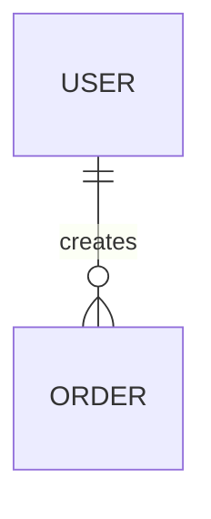

# Document Generator Skill

## Purpose

Generate structured engineering documentation.

Supported outputs:
- ERD
- activity diagram
- sequence diagram
- architecture diagram
- flow documentation
- technical specification

---

# Workflow

1. Analyze:
- actors
- systems
- entities
- flows
- dependencies

2. Generate:
- Mermaid diagrams
- markdown documentation
- structured technical explanations

---

# Output Formats

## ERD



## Activity Diagram

```mermaid
flowchart TD
```

## Sequence Diagram

```mermaid
sequenceDiagram
```

## Architecture Diagram

```mermaid
graph TD
```

---

# Rules

- prefer Mermaid syntax
- keep diagrams readable
- avoid excessive detail
- separate logical and physical architecture
- keep naming consistent
